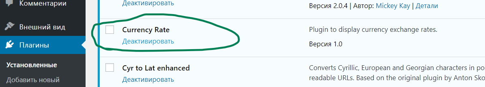
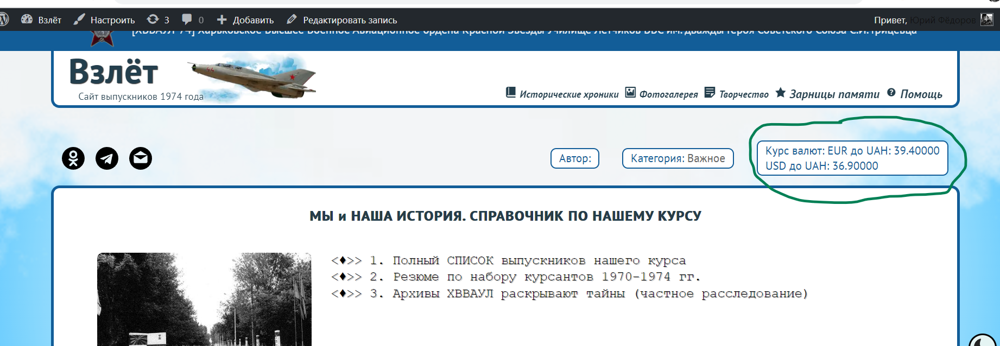

## ТЗ:
Розробити плагін, котрий буде в Вордпресі створювати шорткод, котрий буде називатися currency_rate. При вставці цього шорткоду на сторінці людина зможе вказати в якості параметра валюту з котрої буде виконуватись конвертація та валюту в котру виконується конвератція. Брати курс з будь-якого відкритого API. Приклад [currency_rate from="usd" to="uah"] має вивести курс usd/uah в місці вставки шорткода

## Реалізація
    1. Створюжмо плагін currency-rate-shortcode та зберігаємо його за шляхом \wp-content\plugins\currency_rate_shortcode

```PHP
<?php
/*
Plugin Name: Currency Rate
Description: Plugin to display currency exchange rates.
Version: 1.0
*/

function currency_rate_shortcode($atts) {
    $atts = shortcode_atts( array(
        'from' => 'usd',
        'to' => 'uah'
    ), $atts );

    // API Приватбанка з актуальним курсом валют
    $url = 'https://api.privatbank.ua/p24api/pubinfo?json&exchange&coursid=5';

    // Отримання даних через cURL
    $curl = curl_init($url);
    curl_setopt($curl, CURLOPT_RETURNTRANSFER, true);
    $data = curl_exec($curl);

    $result = '';

    // Перевірка наявності даних та їх виведення
    if ($data) {
        $currency_data = json_decode($data, true);
        // Перегляд курсів валют
        foreach ($currency_data as $currency) {
            $result .= $currency['ccy'] . ' до ' . $currency['base_ccy'] . ': ' . $currency['buy'] . '<br>';
        }
    } else {
        $result = 'Не вдалося отримати дані про курси валют';
    }

    // Закриття cURL-з'єднання
    curl_close($curl);

    return $result;
}

// Реєструю шорткод
add_shortcode('currency_rate', 'currency_rate_shortcode');

```

    2. Активуємо плагін у адмін панелі Wordpress



    3. Для використання викликаємо плагін на потрібній нам сторінці (single.php) командою echo do_shortcode('[currency_rate]');



```PHP
echo do_shortcode('[currency_rate]');
```  